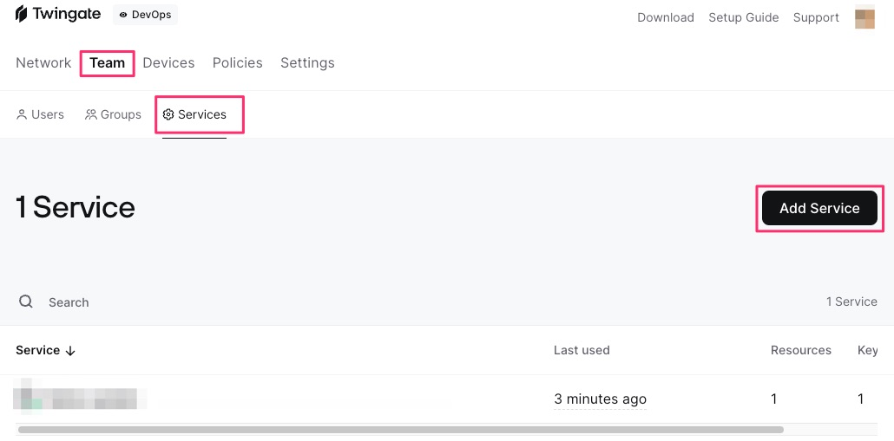
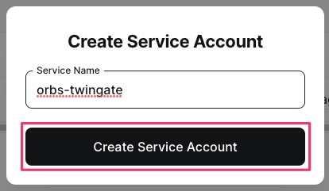
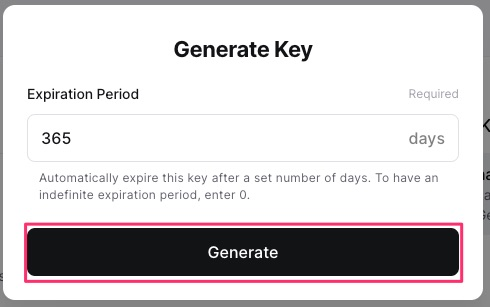
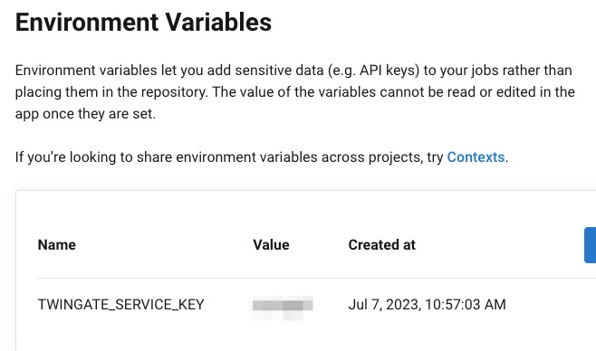

# orbs-twingate

This orb is for easy use of twingate in circleci.

[Twingate](https://www.twingate.com/)

[Twingate ci config sample](https://github.com/Twingate/support/blob/master/.circleci/config.yml)


## Preparation

### 1. Download your team's service key



### 2. Create Service Account

Give your project an appropriate name.



### 3. Generate Service Key

Generate a service key with the name you created.


After setting the expiration date, select "Generate"



### 4. Service key encoding

Encode the downloaded service key with base64.

```bash
$ cat service-key.json| base64 | pbcopy
```

### 5. Set environment variables

Set environment variables to CircleCi's project settings and the context you want to use.
default is named TWINGATE_SERVICE_KEY.




## sample config

```yaml
version: 2.1
orbs:
  twingate: rhems-japan/twingate@x.y.z
  kubernetes: circleci/kubernetes@1.3.0
  aws-eks: circleci/aws-eks@2.2.0
workflows:
  test-workflow:
    jobs:
      - checkout
      - kubernetes/install
      - aws-eks/update-kubeconfig-with-authenticator:
          cluster-name: $CLUSTER_NAME
          aws-region: $AWS_DEFAULT_REGION
      - twingate/install-twingate
      - twingate/start-twingate
      - run:
          name: apply
          working_directory: .circleci/kubernetes
          command: |
            (
              cd overlays/develop
              kubectl apply -f .
            )
      - twingate/stop-twingate
```